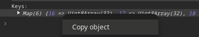

# Ripping HotAudio.net

HotAudio.net is a simple website that provides a catalogue of audio files. Its key feature compared to other similar websites is that the audio played is encrypted which makes ripping much more difficult.

This is my attempt or demo to rip the audio from HotAudio.net. This is not a ready-made `.exe`  you can run. We'll download the `.hax` file and painfully grab encryption keys from the site. Then locally decrypt with a nodejs server.

For reasons, I'm not going to copy paste the entire js file(s). I'll just let you know what I did, so you can understand, recreate and hopefully improve on this method.

## Attempts to download
Downloading with popular tools like yt-dlp or video-downloadhelper result in a `.hax` file that is not playable.
- https://github.com/yt-dlp/yt-dlp/issues/10343
- https://github.com/aclap-dev/video-downloadhelper/discussions/965

Ofcourse, you can just use an audio recorder, but that's not fun.

## Encryption
Let's look at the encryption. When opening the page source, in `nozzle.js` we find that the audio file is encrypted with the [noble-ciphers](https://github.com/paulmillr/noble-ciphers) library which provides "Audited & minimal JS implementation of Salsa20, ChaCha and AES." After investigating, it is very likely the ChaCha20-Poly1305 cipher is used.

Here's the wiki  https://en.wikipedia.org/wiki/ChaCha20-Poly1305 or
I'll let a LLM explain how this applies to `.m3u8` audio streams:

### LLM explains ChaCha20-Poly1305

ChaCha20-Poly1305 is a cryptographic construction that combines the ChaCha20 stream cipher with the Poly1305 message authentication code (MAC). Here's a simplified explanation of how it works when applied to a `.m3u8` audio stream:

**Overview**

`.m3u8` is a playlist format used for streaming media, typically audio or video. Each segment of the stream is a separate file that contains a portion of the audio data. To encrypt the stream, each segment is encrypted individually using ChaCha20-Poly1305.

**Encryption Process**

1. **Key Generation**: A unique encryption key is generated for each segment. This key is used for both encryption and decryption.
2. **ChaCha20 Encryption**: The audio data in each segment is encrypted using the ChaCha20 stream cipher. ChaCha20 is a fast and secure stream cipher that produces a keystream, which is then XORed with the plaintext audio data to produce the ciphertext.
3. **Poly1305 Authentication**: After encryption, a Poly1305 MAC is computed over the ciphertext. The MAC is a digital signature that ensures the integrity and authenticity of the encrypted data.
4. **Encrypted Segment**: The encrypted segment, including the ciphertext and MAC, is written to a file.

**Decryption Process**

1. **Key Retrieval**: The decryption key for each segment is retrieved, which may be stored separately or embedded in the segment file.
2. **Poly1305 Verification**: The MAC is verified using the decryption key and the ciphertext. If the MAC is invalid, the segment is rejected.
3. **ChaCha20 Decryption**: The ciphertext is decrypted using the ChaCha20 stream cipher and the decryption key.
4. **Plaintext Audio**: The decrypted audio data is extracted and played back.

**Key Management**

Since each segment may have a different encryption key, key management becomes crucial. The keys can be stored in a separate file or embedded in the segment files themselves. In some cases, the keys may be derived from a master key using a key derivation function.

**Advantages**

ChaCha20-Poly1305 provides several benefits when applied to `.m3u8` audio streams:

* **Fast Encryption**: ChaCha20 is a fast stream cipher, making it suitable for real-time audio streaming.
* **Secure Authentication**: Poly1305 provides strong authentication and integrity guarantees, ensuring that the encrypted data is authentic and has not been tampered with.
* **Flexible Key Management**: The use of separate keys for each segment allows for flexible key management and rotation.

Overall, ChaCha20-Poly1305 is a robust and efficient cryptographic construction for encrypting `.m3u8` audio streams, providing both confidentiality and integrity guarantees.

## Decryption
Let's establish what's needed to decrypt. We learned that we can't just grab a single key and decrypt our single `.hax`. We need multiple and *sufficient*  keys to decrypt.

For now, simply playing the audio so the keys are stored in memory is enough. Then export the keys and use it to decrypt locally.

## Implementing
We can re-use most of the `nozzle.js` code. It's maybe more messy this way, but it works.

### Browser changes
I use a clean chromium browser for this.

I made a single line browser change to grab the keys:

F12 -> Sources -> Local Overrides -> `nozzle.js`

then apply the `browser.diff`.
```javascript
          this.el.addEventListener("pause", () => {
+             console.log("Keys:\n", this.hax.keys);
              var c;
```
 This will make it so whenever we press pause or the audio is done playing the keys are logged to the console.

### Local implementation
We'll use a local nodejs server to decrypt the `.hax` files.

We can use the same `nozzle.js` as mentioned above as a library for our `main.js`.

Apply the `nozzle.diff` to this file to make it work.

The only dependency is [node-self](https://www.npmjs.com/package/node-self). Simply to stop nodejs from breaking due to lack of "self" or "document".

This should be your local file structure:
```
├── config.js
├── main.js
├── node_modules
├── nozzle.js
├── package.json
├── package-lock.json
└── README.md
```

## The pipeline
1. Open an audio on the website
  a. Download the `.hax` file
  b. Play it. Once done, you can F12 -> right-click Keys -> Copy Object
    * NOTE: You can press "pause" to check if the keys print. Pausing does not clear/remove keys


2. Setup `config.js`
  a. Paste keys into `config.js` so we can use the keys
  b. Paste the `.hax` file's location. Place it in the same directory.

3. Run `node main.js` to decrypt the `.hax` file

If all goes well you now have a audio.m3u8 (I don't know the actual format) that is almost playable.

4. Lastly, fix it with ffmpeg:
`ffmpeg -i audio.m3u8 audio.ts`
or
`ffmpeg -i audio.m3u8 audio.mp3`

XMR: 863m6sLB17K6heaynwZ7WyLVPmX9mDRGNbATzRWimabQMjpEwTeLpuAhfZVm95YeebNA36szdRrLjCbHoxweTuTA342cm7s


